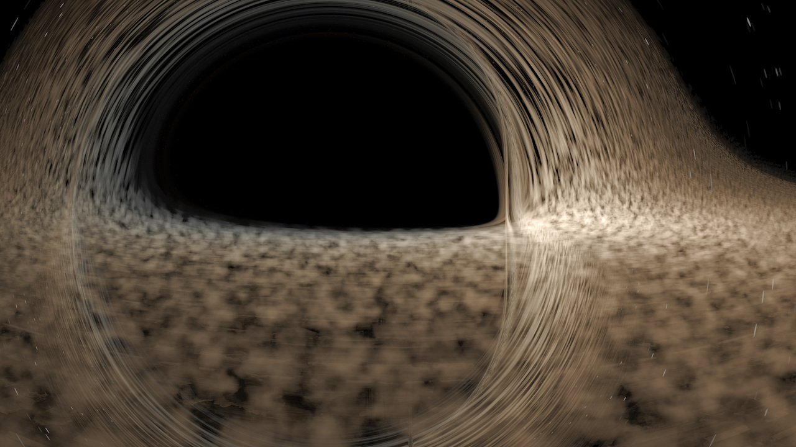

# GR Ray Tracer

A general-relativistic ray tracer written in C++23. Traces null geodesics through Schwarzschild and Kerr spacetimes to render physically accurate black hole images, including accretion disk emission, gravitational lensing, and Doppler beaming. Outputs PNG/HDR images and multi-frequency FITS spectral cubes.

<div align="center">



</div>

---

## Features

- **Schwarzschild & Kerr metrics** — full Boyer-Lindquist coordinates; analytical metric tensors and their derivatives
- **Hamiltonian null geodesics** — RK4 integrator with adaptive step sizing (`dλ ∝ r²`) and Hamiltonian constraint monitoring
- **Thin accretion disk** — circular equatorial orbits, blackbody emission, relativistic redshift/blueshift, Doppler beaming
- **Volumetric accretion disk** — turbulent density field via fBm noise, Shakura-Sunyaev viscosity profile, ray-marched emission and absorption
- **Physical spectral rendering** — multi-frequency radiative transfer at arbitrary observer-frame frequencies; outputs per-pixel spectral intensity in erg/s/cm²/Hz/sr
- **FITS spectral cube output** — streaming row-by-row write; never allocates the full cube in RAM
- **Tone mapping** — Reinhard and ACES operators; auto-exposure; outputs PNG (tone-mapped), `.hdr` (tone-mapped), and `_linear.hdr` (raw linear)
- **OpenMP parallelism** — full-frame and tiled rendering with cancellation and progress callbacks
- **Pure C API** — `grrt_create` / `grrt_render` / `grrt_destroy`; clean DLL boundary, no C++ exceptions exposed

---

## Architecture

```
include/grrt/
├── api.h                  Pure C public interface
├── types.h                GRRTParams, GRRTContext, enums
├── math/                  Vec3, Vec4, Matrix4 (header-only)
├── spacetime/             Metric (abstract), Schwarzschild, Kerr
├── geodesic/              GeodesicState, RK4, GeodesicTracer
├── camera/                Camera — pixel → initial 4-momentum
├── scene/                 AccretionDisk, VolumetricDisk, CelestialSphere
├── render/                Renderer (OpenMP loop), ToneMapper
└── color/                 Spectrum LUT — redshift → XYZ → sRGB

src/                       Implementations of the above
cuda/                      GPU backend (see CUDA note below)
cli/main.cpp               Thin CLI wrapper
tests/                     Unit tests for opacity, volumetric, spectral
third_party/stb_image_write.h
```

**Units:** Geometrized (`G = c = 1`); the black hole mass `M` sets the length scale. All coordinates are Boyer-Lindquist `(t, r, θ, φ)`.

---

## Prerequisites

| Requirement | Version |
|---|---|
| CMake | 3.20+ |
| C++ compiler | MSVC 2022 (VS 17) **or** GCC 13+ / Clang 17+ |
| OpenMP | Optional — auto-detected |
| CUDA Toolkit | 12.x — optional, see note below |

---

## Build

### Windows (Visual Studio 2022)

```bat
cmake -B build -G "Visual Studio 17 2022"
cmake --build build --config Release
```

### Linux / macOS

```bash
cmake -B build
cmake --build build
```

### With CUDA (optional)

```bash
cmake -B build -DGRRT_ENABLE_CUDA=ON -DCMAKE_CUDA_COMPILER=nvcc
cmake --build build --config Release
```

> **CUDA status:** The GPU backend is incomplete and not recommended for general use. The physics integration requires double-precision floating point throughout — consumer GPUs have very limited FP64 throughput (typically 1/32 of FP32), making CUDA unviable on most gaming/prosumer cards. The CPU path with OpenMP is faster in practice on such hardware.

---

## CLI Usage

```
grrt-cli [options]
```

### Options

| Option | Default | Description |
|---|---|---|
| `--width N` | 1024 | Image width in pixels |
| `--height N` | 1024 | Image height in pixels |
| `--metric TYPE` | `kerr` | `schwarzschild` or `kerr` |
| `--mass M` | 1.0 | Black hole mass (geometrized units) |
| `--spin A` | 0.998 | Dimensionless spin parameter `a/M` |
| `--observer-r R` | 50 | Observer radial coordinate |
| `--observer-theta T` | 80° | Observer polar angle (degrees) |
| `--observer-phi P` | 0° | Observer azimuthal angle (degrees) |
| `--fov F` | 90° | Horizontal field of view (degrees) |
| `--disk on\|off` | on | Enable thin accretion disk |
| `--disk-outer R` | 20 | Disk outer radius in `M` |
| `--disk-temp T` | — | Peak disk temperature in K |
| `--disk-volumetric` | off | Use volumetric disk model |
| `--disk-alpha A` | 0.1 | Shakura-Sunyaev viscosity α |
| `--disk-turbulence T` | 0.4 | Turbulent noise amplitude |
| `--disk-seed N` | 42 | Noise PRNG seed |
| `--disk-noise-octaves N` | 2 | fBm octave count |
| `--mass-solar M` | — | BH mass in solar masses (derives disk temperature) |
| `--eddington-fraction F` | — | Accretion rate as Eddington fraction (derives disk temperature) |
| `--background TYPE` | `stars` | `black` or `stars` |
| `--max-steps N` | 10000 | Max geodesic integration steps |
| `--tolerance T` | 1e-8 | Integrator adaptive-step tolerance |
| `--samples N` | 1 | Samples per pixel (anti-aliasing) |
| `--threads N` | 0 (auto) | CPU thread count |
| `--output NAME` | `output` | Output base name; produces `NAME.png`, `NAME.hdr`, `NAME_linear.hdr` |
| `--frequencies LIST` | — | Comma-separated frequencies in Hz for spectral render |
| `--freq-range MIN MAX N` | — | Log-spaced frequency range: min Hz, max Hz, N bins |

### Examples

```bash
# Kerr black hole, near-maximal spin, 4× anti-aliasing
grrt-cli --metric kerr --spin 0.998 --observer-r 50 --samples 4 --output kerr_aa

# Schwarzschild, edge-on view
grrt-cli --metric schwarzschild --observer-theta 90 --output schwarzschild_edgeon

# Physical disk temperature from mass and accretion rate
grrt-cli --mass-solar 10 --eddington-fraction 0.1 --output physical_disk

# Volumetric disk with turbulence
grrt-cli --disk-volumetric --disk-turbulence 0.6 --disk-noise-octaves 4 --output vol_disk

# Spectral render across radio → X-ray
grrt-cli --freq-range 1e9 1e18 64 --output spectrum
# Produces spectrum.fits in addition to the usual PNG/HDR outputs
```

---

## Spectral / FITS Output

When `--frequencies` or `--freq-range` is specified the renderer performs multi-frequency radiative transfer and writes a FITS data cube:

```
FITS axes: [frequency, y, x]
Units:     erg / s / cm² / Hz / sr  (specific intensity, observer frame)
```

The FITS writer streams one row at a time so memory usage is `O(width × num_bins)` regardless of image size. This keeps multi-hundred-bin renders tractable on ordinary hardware.

---

## C API

The shared library exposes a plain C interface, suitable for calling from Python (`ctypes`), Julia, or any language with a C FFI.

```c
#include "grrt/api.h"

// Populate parameters
GRRTParams p = {};
p.width = 1024; p.height = 1024;
p.metric_type = GRRT_METRIC_KERR;
p.spin = 0.998;
p.observer_r = 50.0;
p.observer_theta = 1.396; // ~80° in radians
p.fov = 1.571;            // 90°
p.disk_enabled = 1;
p.background_type = GRRT_BG_STARS;

// Create context
GRRTContext* ctx = grrt_create(&p);

// Render into RGBA float buffer
float* fb = malloc(1024 * 1024 * 4 * sizeof(float));
int ok = grrt_render(ctx, fb);

// Apply tone mapping in-place
grrt_tonemap(fb, 1024, 1024);

grrt_destroy(ctx);
```

Progress and cancellation:

```c
grrt_render_cb(ctx, fb, my_progress_fn, user_data);
grrt_cancel(ctx);               // safe to call from another thread
float pct = grrt_progress(ctx); // [0, 1]
```

Tile rendering (for multi-threaded compositing):

```c
grrt_render_tile(ctx, tile_buf, tile_x, tile_y, tile_w, tile_h);
```

---

## Physics Notes

- **Null geodesic equation** — Hamiltonian formulation: `H = ½ g^μν p_μ p_ν = 0`. The constraint `|H| < 1e-10` is monitored throughout integration.
- **Conserved quantities** — Along any Schwarzschild geodesic, `E = -p_t` and `L = p_φ` are constant; deviations flag integration errors.
- **Shadow radius** — For a Schwarzschild black hole at large distance: `θ_shadow = arcsin(3√3 M / r_obs)`.
- **Disk beaming** — The approaching (blueshifted) side of the disk appears significantly brighter than the receding side, as expected from relativistic Doppler beaming.
- **Adaptive step size** — `dλ ∝ r²` keeps steps physically small near the horizon and large in flat space, balancing accuracy and speed.

---

## Validation

```bash
# Build and run unit tests
cmake --build build
./build/Release/test-opacity
./build/Release/test-volumetric
./build/Release/test-spectral

# Cross-validate CPU vs CUDA backends
grrt-cli --validate --output validation
```

---

## Third-Party

| Library | License | Use |
|---|---|---|
| [stb_image_write](https://github.com/nothings/stb) | Public Domain | PNG/HDR output |
| OpenMP | LLVM Exception / GPL | CPU parallelism |
| CUDA Toolkit 12.x | NVIDIA CUDA EULA | GPU backend (optional) |
